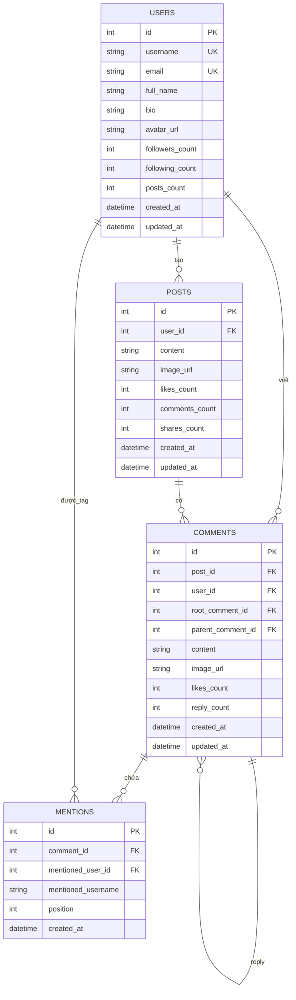

# WebDemo - Social Media Platform

Nền tảng mạng xã hội được xây dựng với React.js, Node.js và SQLite. Tập trung vào hệ thống comment nested và tương tác xã hội.

## 🚀 Tính năng

- ✅ **Đăng nhập an toàn** với JWT authentication
- ✅ **Giao diện hiện đại** thiết kế theo chuẩn Facebook
- ✅ **Đăng bài viết** với text và hình ảnh
- ✅ **Tương tác xã hội** - Like, Comment, Share
- ✅ **Tin tức công ty** hàng ngày
- ✅ **Sách hay nên đọc** và giới thiệu
- ✅ **Sự kiện công ty** - 8/3, 20/10, hoạt động bộ phận
- ✅ **Quản lý hồ sơ** cá nhân
- ✅ **Responsive design** cho mọi thiết bị

## 🛠️ Công nghệ sử dụng

### Frontend
- **React 18** với TypeScript
- **Tailwind CSS** cho styling
- **Axios** cho API calls
- **React Router** cho navigation

### Backend
- **Node.js** với Express
- **SQLite** database
- **JWT** authentication
- **bcryptjs** cho password hashing

## 📦 Cài đặt và Chạy ứng dụng

### Bước 1: Clone repository
```bash
git clone https://github.com/zcamb1/S-Connect.git
cd S-Connect
```

### Bước 2: Cài đặt dependencies
```bash
# Cài đặt dependencies cho root project
npm install

# Cài đặt dependencies cho backend
cd server
npm install

# Cài đặt dependencies cho frontend
cd ../client
npm install
```

### Bước 3: Tạo database (chỉ cần lần đầu)

Database SQLite đã được tạo sẵn trong dự án. Nếu bạn muốn tạo lại database từ đầu:

```bash
cd server

# Tạo database mới với đầy đủ schema và dữ liệu mẫu
node initDatabase.js

# Thêm comment mẫu (tùy chọn)
node seedComments.js

# Kiểm tra database đã được tạo đúng chưa
node checkSchema.js
```

### Bước 4: Cấu hình environment (tùy chọn)
Tạo file `.env` trong thư mục `server`:
```env
PORT=3001
JWT_SECRET=your-super-secret-jwt-key
```

### Bước 5: Chạy ứng dụng

#### Chạy cả Frontend và Backend cùng lúc (Khuyến nghị):
```bash
# Từ thư mục root
npm run dev
```

#### Hoặc chạy riêng biệt:

**Backend:**
```bash
cd server
npm run dev
# Server sẽ chạy tại http://localhost:3001
```

**Frontend:**
```bash
cd client
npm start
# React app sẽ chạy tại http://localhost:3000
```

## 👤 Tài khoản Demo

Database đã được tạo sẵn các user mẫu để test:

| Username | Password | Vai trò |
|----------|----------|---------|
| `admin` | `123456` | Quản trị viên |
| `john.doe` | `123456` | Marketing Manager |
| `jane.smith` | `123456` | HR Director |

## 📱 Hướng dẫn sử dụng

### 1. Đăng nhập
- Mở trình duyệt và truy cập `http://localhost:3000`
- Sử dụng một trong các tài khoản demo ở trên
- Nhấn **"Đăng nhập"**

### 2. Tạo bài viết
- Nhấp vào ô **"Bạn đang nghĩ gì?"**
- Nhập nội dung bài viết
- Nhấn **"Đăng"** để xuất bản

### 3. Tương tác với bài viết
- **Like**: Nhấp biểu tượng ❤️
- **Comment**: Nhấp "Bình luận" (đang phát triển)
- **Share**: Nhấp "Chia sẻ" (đang phát triển)

### 4. Điều hướng
- **Sidebar trái**: Điều hướng chính (Trang chủ, Hồ sơ, Sự kiện...)
- **Sidebar phải**: Sự kiện sắp tới, bạn bè online, sinh nhật

## 🏗️ Kiến trúc hệ thống

```mermaid
graph TB
    subgraph "Client (React)"
        A["React App<br/>Port: 3000"]
        A1["Components"]
        A2["Contexts"]
        A3["Data/Mock"]
        A --> A1
        A --> A2
        A --> A3
    end
    
    subgraph "Server (Node.js)"
        B["Express Server<br/>Port: 3001"]
        B1["API Routes"]
        B2["Upload Handler"]
        B3["Database Scripts"]
        B --> B1
        B --> B2
        B --> B3
    end
    
    subgraph "Database"
        C["SQLite Database"]
        C1["Users Table"]
        C2["Posts Table"]
        C3["Comments Table<br/>(Nested)"]
        C4["Mentions Table"]
        C --> C1
        C --> C2
        C --> C3
        C --> C4
    end
    
    subgraph "File Storage"
        D["Uploads Folder"]
        D1["Comment Images"]
        D --> D1
    end
    
    A1 -.->|"API Calls<br/>(Axios)"| B1
    B1 -.->|"SQL Queries"| C
    B2 -.->|"Save Files"| D
    B3 -.->|"Init/Seed"| C
    
    style A fill:#61dafb
    style B fill:#68a063
    style C fill:#003b57
    style D fill:#f39c12
```



## 🔧 Cấu trúc thư mục

```
webdemo/
├── client/                 # Frontend React app
│   ├── public/            # Static files
│   ├── src/
│   │   ├── components/    # React components
│   │   ├── contexts/      # React contexts
│   │   ├── data/          # Mock data files
│   │   ├── lib/           # Utility libraries
│   │   ├── utils/         # Helper functions
│   │   ├── index.css      # Tailwind CSS
│   │   ├── index.tsx      # Entry point
│   │   └── App.tsx        # Main app component
│   └── package.json
├── server/                # Backend Node.js
│   ├── index.js          # Express server
│   ├── database.sqlite   # SQLite database
│   ├── initDatabase.js   # Database setup script
│   ├── seedComments.js   # Add sample comments
│   ├── checkSchema.js    # Verify database structure
│   ├── deleteComments.js # Utility to delete comments
│   ├── testAPI.js        # API testing script
│   ├── uploads/          # File upload directory
│   ├── README.md         # Server documentation
│   └── package.json
├── src/                   # Additional components
│   └── components/
└── package.json          # Root package with scripts
```

## 🗄️ Database Schema

Database sử dụng SQLite với các bảng chính:



### Users Table
```sql
- id (INTEGER PRIMARY KEY)
- username (TEXT UNIQUE)
- email (TEXT UNIQUE)
- full_name (TEXT)
- bio (TEXT DEFAULT '')
- avatar_url (TEXT DEFAULT '')
- followers_count (INTEGER DEFAULT 0)
- following_count (INTEGER DEFAULT 0)
- posts_count (INTEGER DEFAULT 0)
- created_at (DATETIME DEFAULT CURRENT_TIMESTAMP)
- updated_at (DATETIME DEFAULT CURRENT_TIMESTAMP)
```

### Posts Table
```sql
- id (INTEGER PRIMARY KEY)
- user_id (INTEGER)
- content (TEXT)
- image_url (TEXT DEFAULT '')
- likes_count (INTEGER DEFAULT 0)
- comments_count (INTEGER DEFAULT 0)
- shares_count (INTEGER DEFAULT 0)
- created_at (DATETIME DEFAULT CURRENT_TIMESTAMP)
- updated_at (DATETIME DEFAULT CURRENT_TIMESTAMP)
```

### Comments Table (Nested Comments System)
```sql
- id (INTEGER PRIMARY KEY)
- post_id (INTEGER)
- user_id (INTEGER)
- root_comment_id (INTEGER DEFAULT NULL)    # ID của comment gốc
- parent_comment_id (INTEGER DEFAULT NULL)  # ID của comment cha
- content (TEXT)
- image_url (TEXT DEFAULT '')
- likes_count (INTEGER DEFAULT 0)
- reply_count (INTEGER DEFAULT 0)
- created_at (DATETIME DEFAULT CURRENT_TIMESTAMP)
- updated_at (DATETIME DEFAULT CURRENT_TIMESTAMP)
```

### Mentions Table
```sql
- id (INTEGER PRIMARY KEY)
- comment_id (INTEGER)
- mentioned_user_id (INTEGER)
- mentioned_username (TEXT)
- position (INTEGER)
- created_at (DATETIME DEFAULT CURRENT_TIMESTAMP)
```

## 🚀 Triển khai Production

### Frontend (Vercel/Netlify)
```bash
cd client
npm run build
# Upload thư mục build/ lên hosting
```

### Backend (Heroku/Railway)
```bash
cd server
# Cấu hình environment variables
# Deploy theo hướng dẫn của platform
```

## 🛡️ Bảo mật

- JWT tokens với thời hạn 24h
- Password được hash với bcryptjs
- CORS được cấu hình cho cross-origin requests
- Input validation cho tất cả API endpoints

## 🗄️ Database Utilities

### Scripts có sẵn:
```bash
cd server

# Tạo database mới từ đầu
node initDatabase.js

# Thêm comment mẫu (nested comments)  
node seedComments.js

# Kiểm tra cấu trúc database
node checkSchema.js

# Xóa tất cả comments
node deleteComments.js

# Test API endpoints
node testAPI.js
```

## 🔄 API Endpoints

### Authentication
- `POST /api/login` - Đăng nhập
- `GET /api/me` - Lấy thông tin user hiện tại

### Posts
- `GET /api/posts` - Lấy danh sách bài viết
- `POST /api/posts` - Tạo bài viết mới
- `POST /api/posts/:id/like` - Like/Unlike bài viết
- `GET /api/posts/comment-counts` - Lấy số lượng comment của các post

### Comments (Nested Comments System)
- `GET /api/posts/:postId/comments` - Lấy comments của bài viết (hỗ trợ nested)
- `POST /api/posts/:postId/comments` - Thêm comment mới
- `POST /api/posts/:postId/comments/:commentId/reply` - Reply comment
- `POST /upload` - Upload hình ảnh cho comment

## 🤝 Đóng góp

1. Fork project
2. Tạo feature branch (`git checkout -b feature/AmazingFeature`)
3. Commit changes (`git commit -m 'Add some AmazingFeature'`)
4. Push to branch (`git push origin feature/AmazingFeature`)
5. Tạo Pull Request

## 📝 License

Distributed under the MIT License. See `LICENSE` for more information.

## 📧 Liên hệ

Nếu có vấn đề gì, vui lòng tạo issue hoặc liên hệ team phát triển.

---

**Happy Connecting! 🎉** 