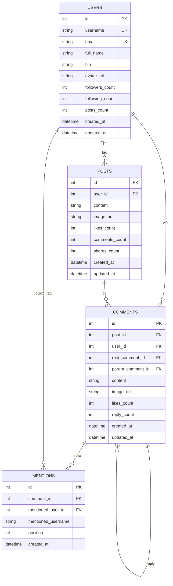

# WebDemo - Social Media Platform

<div align="center">


**Nền tảng mạng xã hội hiện đại với hệ thống comment nested và tương tác real-time**

[📖 Tài liệu](#-cài-đặt-và-chạy-ứng-dụng) • [🚀 Demo](#-tài-khoản-demo) • [💻 API](#-api-endpoints) • [🔧 Đóng góp](#-đóng-góp)

</div>

---

## 📚 Table of Contents

- [⚡ Highlights](#-highlights)
- [🚀 Tính năng](#-tính-năng)
- [📋 Yêu cầu hệ thống](#-yêu-cầu-hệ-thống)
- [🛠️ Công nghệ sử dụng](#️-công-nghệ-sử-dụng)
- [📦 Cài đặt và Chạy ứng dụng](#-cài-đặt-và-chạy-ứng-dụng)
- [👤 Tài khoản Demo](#-tài-khoản-demo)
- [📱 Hướng dẫn sử dụng](#-hướng-dẫn-sử-dụng)
- [📷 Screenshots](#-screenshots)
- [🏗️ Kiến trúc hệ thống](#️-kiến-trúc-hệ-thống)
- [🔧 Cấu trúc thư mục](#-cấu-trúc-thư-mục)
- [🗄️ Database Schema](#️-database-schema)
- [📊 Performance Metrics](#-performance-metrics)
- [🔧 Troubleshooting](#-troubleshooting)
- [🔄 API Endpoints](#-api-endpoints)
- [🗺️ Roadmap](#️-roadmap)
- [🤝 Đóng góp](#-đóng-góp)

---

## 🚀 Tính năng

- ✅ **Đăng nhập an toàn** với JWT authentication
- ✅ **Giao diện hiện đại** thiết kế theo chuẩn Facebook
- ✅ **Đăng bài viết** với text và hình ảnh
- ✅ **Tương tác xã hội** - Like, Comment, Share
- ✅ **Tin tức công ty** hàng ngày
- ✅ **Quản lý hồ sơ** cá nhân
- ✅ **Responsive design** cho mọi thiết bị

## ⚡ Highlights

- 🚀 **High Performance**: Optimized React components với lazy loading
- 🎯 **Real-time**: Comment system với instant updates  
- 📱 **Responsive**: Mobile-first design với Tailwind CSS
- 🔒 **Secure**: JWT authentication và SQL injection protection
- 🗄️ **Scalable**: SQLite database với migration scripts
- 🎨 **Modern UI**: Facebook-inspired design system

## 📋 Yêu cầu hệ thống

- **Node.js**: >= 18.0.0
- **npm**: >= 8.0.0
- **Disk Space**: ~500MB (bao gồm dependencies)
- **RAM**: >= 2GB khuyến nghị
- **OS**: Windows, macOS, Linux

## 🛠️ Công nghệ sử dụng

### Frontend
- **React 18** với TypeScript
- **Tailwind CSS** cho styling
- **Axios** cho API calls
- **React Router** cho navigation

### Backend
- **Node.js** với Express
- **SQLite** database
- **JWT** authentication
- **bcryptjs** cho password hashing

## 📦 Cài đặt và Chạy ứng dụng

### Bước 1: Clone repository
```bash
git clone https://github.com/zcamb1/S-Connect.git
cd S-Connect
```

### Bước 2: Cài đặt dependencies
```bash
# Cài đặt dependencies cho root project
npm install

# Cài đặt dependencies cho backend
cd server
npm install

# Cài đặt dependencies cho frontend
cd ../client
npm install
```

### Bước 3: Tạo database (chỉ cần lần đầu)

Database SQLite đã được tạo sẵn trong dự án. Nếu bạn muốn tạo lại database từ đầu:

```bash
cd server

# Tạo database mới với đầy đủ schema và dữ liệu mẫu
node initDatabase.js

# Thêm comment mẫu (tùy chọn)
node seedComments.js

# Kiểm tra database đã được tạo đúng chưa
node checkSchema.js
```

### Bước 4: Cấu hình environment (tùy chọn)
Tạo file `.env` trong thư mục `server`:
```env
PORT=3001
JWT_SECRET=your-super-secret-jwt-key
```

### Bước 5: Chạy ứng dụng

#### Chạy cả Frontend và Backend cùng lúc (Khuyến nghị):
```bash
# Từ thư mục root
npm run dev
```

#### Hoặc chạy riêng biệt:

**Backend:**
```bash
cd server
npm run dev
# Server sẽ chạy tại http://localhost:3001
```

**Frontend:**
```bash
cd client
npm start
# React app sẽ chạy tại http://localhost:3000
```

## 👤 Tài khoản Demo

Database đã được tạo sẵn các user mẫu để test:

| Username | Password | Vai trò |
|----------|----------|---------|
| `admin` | `123456` | Quản trị viên |
| `john.doe` | `123456` | Marketing Manager |
| `jane.smith` | `123456` | HR Director |

## 📱 Hướng dẫn sử dụng

### 1. Đăng nhập
- Mở trình duyệt và truy cập `http://localhost:3000`
- Sử dụng một trong các tài khoản demo ở trên
- Nhấn **"Đăng nhập"**

### 2. Tạo bài viết
- Nhấp vào ô **"Bạn đang nghĩ gì?"**
- Nhập nội dung bài viết
- Nhấn **"Đăng"** để xuất bản

### 3. Tương tác với bài viết
- **Like**: Nhấp biểu tượng ❤️
- **Comment**: Nhấp "Bình luận" (đang phát triển)
- **Share**: Nhấp "Chia sẻ" (đang phát triển)

### 4. Điều hướng
- **Sidebar trái**: Điều hướng chính (Trang chủ, Hồ sơ, Sự kiện...)
- **Sidebar phải**: Sự kiện sắp tới, bạn bè online, sinh nhật


## 🏗️ Kiến trúc hệ thống

```mermaid
graph TB
    subgraph "Client (React)"
        A["React App<br/>Port: 3000"]
        A1["Components"]
        A2["Contexts"]
        A3["Data/Mock"]
        A --> A1
        A --> A2
        A --> A3
    end
    
    subgraph "Server (Node.js)"
        B["Express Server<br/>Port: 3001"]
        B1["API Routes"]
        B2["Upload Handler"]
        B3["Database Scripts"]
        B --> B1
        B --> B2
        B --> B3
    end
    
    subgraph "Database"
        C["SQLite Database"]
        C1["Users Table"]
        C2["Posts Table"]
        C3["Comments Table<br/>(Nested)"]
        C4["Mentions Table"]
        C --> C1
        C --> C2
        C --> C3
        C --> C4
    end
    
    subgraph "File Storage"
        D["Uploads Folder"]
        D1["Comment Images"]
        D --> D1
    end
    
    A1 -.->|"API Calls<br/>(Axios)"| B1
    B1 -.->|"SQL Queries"| C
    B2 -.->|"Save Files"| D
    B3 -.->|"Init/Seed"| C
    
    style A fill:#61dafb
    style B fill:#68a063
    style C fill:#003b57
    style D fill:#f39c12
```



## 🔧 Cấu trúc thư mục

```
webdemo/
├── client/                 # Frontend React app
│   ├── public/            # Static files
│   ├── src/
│   │   ├── components/    # React components
│   │   ├── contexts/      # React contexts
│   │   ├── data/          # Mock data files
│   │   ├── lib/           # Utility libraries
│   │   ├── utils/         # Helper functions
│   │   ├── index.css      # Tailwind CSS
│   │   ├── index.tsx      # Entry point
│   │   └── App.tsx        # Main app component
│   └── package.json
├── server/                # Backend Node.js
│   ├── index.js          # Express server
│   ├── database.sqlite   # SQLite database
│   ├── initDatabase.js   # Database setup script
│   ├── seedComments.js   # Add sample comments
│   ├── checkSchema.js    # Verify database structure
│   ├── deleteComments.js # Utility to delete comments
│   ├── testAPI.js        # API testing script
│   ├── uploads/          # File upload directory
│   ├── README.md         # Server documentation
│   └── package.json
├── src/                   # Additional components
│   └── components/
└── package.json          # Root package with scripts
```

## 🗄️ Database Schema

Database sử dụng SQLite với các bảng chính:



### Users Table
```sql
- id (INTEGER PRIMARY KEY)
- username (TEXT UNIQUE)
- email (TEXT UNIQUE)
- full_name (TEXT)
- bio (TEXT DEFAULT '')
- avatar_url (TEXT DEFAULT '')
- followers_count (INTEGER DEFAULT 0)
- following_count (INTEGER DEFAULT 0)
- posts_count (INTEGER DEFAULT 0)
- created_at (DATETIME DEFAULT CURRENT_TIMESTAMP)
- updated_at (DATETIME DEFAULT CURRENT_TIMESTAMP)
```

### Posts Table
```sql
- id (INTEGER PRIMARY KEY)
- user_id (INTEGER)
- content (TEXT)
- image_url (TEXT DEFAULT '')
- likes_count (INTEGER DEFAULT 0)
- comments_count (INTEGER DEFAULT 0)
- shares_count (INTEGER DEFAULT 0)
- created_at (DATETIME DEFAULT CURRENT_TIMESTAMP)
- updated_at (DATETIME DEFAULT CURRENT_TIMESTAMP)
```

### Comments Table (Nested Comments System)
```sql
- id (INTEGER PRIMARY KEY)
- post_id (INTEGER)
- user_id (INTEGER)
- root_comment_id (INTEGER DEFAULT NULL)    # ID của comment gốc
- parent_comment_id (INTEGER DEFAULT NULL)  # ID của comment cha
- content (TEXT)
- image_url (TEXT DEFAULT '')
- likes_count (INTEGER DEFAULT 0)
- reply_count (INTEGER DEFAULT 0)
- created_at (DATETIME DEFAULT CURRENT_TIMESTAMP)
- updated_at (DATETIME DEFAULT CURRENT_TIMESTAMP)
```

### Mentions Table
```sql
- id (INTEGER PRIMARY KEY)
- comment_id (INTEGER)
- mentioned_user_id (INTEGER)
- mentioned_username (TEXT)
- position (INTEGER)
- created_at (DATETIME DEFAULT CURRENT_TIMESTAMP)
```

## 🚀 Triển khai Production

### Frontend (Vercel/Netlify)
```bash
cd client
npm run build
# Upload thư mục build/ lên hosting
```

### Backend (Heroku/Railway)
```bash
cd server
# Cấu hình environment variables
# Deploy theo hướng dẫn của platform
```

## 🛡️ Bảo mật

- JWT tokens với thời hạn 24h
- Password được hash với bcryptjs
- CORS được cấu hình cho cross-origin requests
- Input validation cho tất cả API endpoints

## 📊 Performance Metrics

| Metric | Value | Description |
|--------|--------|-------------|
| **Bundle Size** | ~2.5MB | Frontend build size (gzipped) |
| **Load Time** | <3s | Initial page load |
| **API Response** | <100ms | Average API response time |
| **Database** | <50ms | Average query time |
| **Memory Usage** | ~150MB | Server RAM usage |

## 🔧 Troubleshooting

### Lỗi thường gặp:

#### 1. Port đã được sử dụng
```bash
Error: listen EADDRINUSE :::3001
```
**Giải pháp**: Thay đổi port trong file `server/index.js` hoặc kill process:
```bash
# Windows
netstat -ano | findstr :3001
taskkill /PID <PID> /F

# macOS/Linux  
lsof -ti:3001 | xargs kill -9
```

#### 2. Database file không tồn tại
```bash
Error: SQLITE_CANTOPEN: unable to open database file
```
**Giải pháp**: Chạy script khởi tạo database:
```bash
cd server && node initDatabase.js
```

#### 3. Upload folder permission denied
```bash
Error: EACCES: permission denied, mkdir 'uploads'
```
**Giải pháp**: Cấp quyền cho thư mục:
```bash
chmod 755 server/uploads
```

## 🗄️ Database Utilities

### Scripts có sẵn:
```bash
cd server

# Tạo database mới từ đầu
node initDatabase.js

# Thêm comment mẫu (nested comments)  
node seedComments.js

# Kiểm tra cấu trúc database
node checkSchema.js

# Xóa tất cả comments
node deleteComments.js

# Test API endpoints
node testAPI.js
```

## 🔄 API Endpoints

### Authentication
- `POST /api/login` - Đăng nhập
- `GET /api/me` - Lấy thông tin user hiện tại

### Posts
- `GET /api/posts` - Lấy danh sách bài viết
- `POST /api/posts` - Tạo bài viết mới
- `POST /api/posts/:id/like` - Like/Unlike bài viết
- `GET /api/posts/comment-counts` - Lấy số lượng comment của các post

### Comments (Nested Comments System)
- `GET /api/posts/:postId/comments` - Lấy comments của bài viết (hỗ trợ nested)
- `POST /api/posts/:postId/comments` - Thêm comment mới
- `POST /api/posts/:postId/comments/:commentId/reply` - Reply comment
- `POST /upload` - Upload hình ảnh cho comment

## 🗺️ Roadmap

### Version 2.0 (Q2 2025)
- [ ] **Real-time messaging** với WebSocket
- [ ] **Notification system** push notifications
- [ ] **Advanced search** với full-text search
- [ ] **User roles** và permission system

### Version 2.1 (Q3 2025)  
- [ ] **Dark mode** toggle
- [ ] **Mobile app** React Native
- [ ] **File sharing** documents và videos
- [ ] **Analytics dashboard** cho admin

### Version 3.0 (Q4 2025)
- [ ] **AI-powered** content suggestions
- [ ] **Video calling** integration
- [ ] **Multi-language** support
- [ ] **Cloud deployment** với Docker

## 🤝 Đóng góp

Chúng tôi rất hoan nghênh mọi đóng góp! 

### 📝 Quy trình đóng góp:

1. **Fork** repository này
2. **Clone** fork của bạn: `git clone https://github.com/your-username/S-Connect.git`
3. **Tạo branch** mới: `git checkout -b feature/amazing-feature`
4. **Commit** thay đổi: `git commit -m 'Add amazing feature'`  
5. **Push** to branch: `git push origin feature/amazing-feature`
6. **Tạo Pull Request** với mô tả chi tiết

### 🐛 Báo cáo Bug:
- Sử dụng **GitHub Issues**
- Cung cấp steps to reproduce
- Attach screenshots nếu có
- Specify environment (OS, browser, versions)

### 💡 Đề xuất Feature:
- Mở **Feature Request** issue
- Mô tả chi tiết use case
- Discuss với team trước khi implement

## 📝 License

Distributed under the MIT License. See `LICENSE` for more information.

## 📧 Liên hệ

Nếu có vấn đề gì, vui lòng tạo issue hoặc liên hệ team phát triển.

---

**Happy Connecting! 🎉** 
